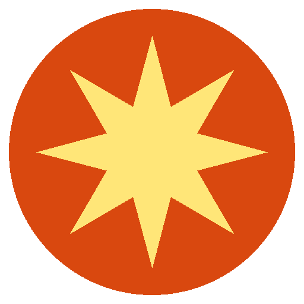
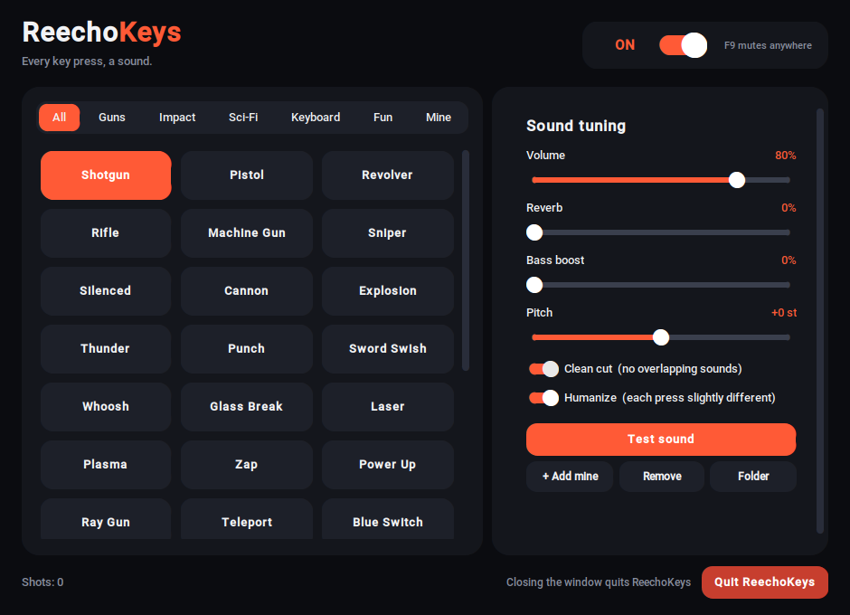

<p align="center">
  
</p>

<h1 align="center">ReechoKeys</h1>
<p align="center"><b>Every key press, a sound.</b><br>
Turn your keyboard into a shotgun, a laser, a typewriter or a marimba - in <i>every</i> app.</p>

<p align="center">
  <a href="https://github.com/neminorniel24-droid/reechokeys/releases/latest"><b>Download</b></a> ·
  <a href="#install">Install</a> ·
  <a href="#how-to-use">How to use</a> ·
  <a href="#troubleshooting">Troubleshooting</a> ·
  <a href="CONTRIBUTING.md">Contribute</a>
</p>

<p align="center"></p>

## Features

- **34 built-in sounds** in 5 categories: Guns, Impact, Sci-Fi, Keyboard (blue / red / brown switch, thock, typewriter) and Fun (coin, boing, bell, marimba, drums...). All are synthesized in code, so there are no audio files to download.
- **Works everywhere** - browser, games, documents, terminals. It reacts to key presses system-wide.
- **Live tuning** - volume, reverb, bass boost and pitch sliders, plus *Humanize* so no two presses sound identical.
- **Clean cut** - fast typing stays crisp instead of turning into a wall of overlapping sound.
- **Bring your own sounds** - add `.wav`, `.ogg`, `.mp3` or `.flac` files. Put several files in one folder to make a *pack* (a random one plays on each press).
- **Easy to switch off** - power switch in the app, **F9** anywhere, tray menu, or the Quit button.
- **Private** - ReechoKeys only reacts to *"a key was pressed"*. It never records, stores or sends what you type, and it makes no network connections. The code is short and open, so you can check.

## Install

Download the file for your system from the **[latest release](https://github.com/neminorniel24-droid/reechokeys/releases/latest)**.

| System | File | Status |
|---|---|---|
| Windows 10 / 11 | `ReechoKeys-Setup.exe` | Tested |
| Linux (X11) | `ReechoKeys-Linux.tar.gz` | Runs from source (tested); binary is community-tested |
| macOS | `ReechoKeys-macOS.zip` | Experimental |

### Windows

1. Download and double-click `ReechoKeys-Setup.exe`.
2. If Windows shows **"Windows protected your PC"**, click **More info** then **Run anyway**. (The installer isn't code-signed, because certificates cost money. The full source is in this repository.)
3. Follow the installer. Optionally tick *desktop shortcut* and *start with Windows*.
4. Open **ReechoKeys**, pick a sound, and type anywhere.

Closing the window keeps ReechoKeys running in the system tray (near the clock). Right-click the tray icon to **Quit** completely.

### macOS (experimental)

1. Download `ReechoKeys-macOS.zip`, unzip it, and drag **ReechoKeys.app** into **Applications**.
2. The app isn't signed by Apple, so the first time **right-click it -> Open -> Open**. If macOS still refuses, run once in Terminal:
   ```bash
   xattr -dr com.apple.quarantine /Applications/ReechoKeys.app
   ```
3. **Grant permission** - macOS blocks apps from seeing key presses until you allow it. Open **System Settings -> Privacy & Security** and add **ReechoKeys** under both:
   - **Accessibility**
   - **Input Monitoring**

   Then quit and reopen ReechoKeys.
4. On macOS, closing the window quits the app (there is no tray icon).

### Linux

> Works on **X11** sessions. On **Wayland**, global key listening is blocked by the system and only works for apps running through XWayland. If sounds don't play in some apps, choose *"Ubuntu on Xorg"* / *"GNOME on Xorg"* at the login screen.

**Option A - download the binary**
```bash
tar -xzf ReechoKeys-Linux.tar.gz
chmod +x ReechoKeys
./ReechoKeys
```

**Option B - run from source** (works on any distro)
```bash
sudo apt install python3 python3-pip python3-tk git     # Fedora: sudo dnf install python3-tkinter
git clone https://github.com/neminorniel24-droid/reechokeys.git
cd reechokeys
pip install -r requirements.txt
python3 reechokeys.py
```
Tray icons on GNOME need the *AppIndicator* extension. Without one, closing the window quits the app.

## How to use

1. **Pick a sound** from the cards (use the tabs to filter). Clicking a card plays a preview.
2. **Tune it** with the sliders on the right. Changes apply after a quarter of a second.
3. **Type anywhere.** Every key press plays the sound.
4. **Turn it off** with the power switch (top right), **F9**, or the red **Quit ReechoKeys** button.

**Adding your own sounds:** click **+ Add mine** and choose audio files. They appear under the **Mine** tab. For a *pack*, click **Folder**, create a sub-folder, and put several files inside. Your sounds and settings are stored in a `.reechokeys` folder in your home directory.

## Troubleshooting

| Problem | Fix |
|---|---|
| No sound at all | Check your system volume, the in-app volume slider and the power switch. Press **F9** once in case it's muted. |
| No sound in one specific app (Windows) | That app is running as administrator. Right-click ReechoKeys -> *Run as administrator*. |
| No sound in a game | Some anti-cheat systems block keyboard listeners. Don't use ReechoKeys there. |
| macOS: nothing happens when typing | Add ReechoKeys to **Accessibility** and **Input Monitoring**, then restart it. |
| Linux: works in some apps only | You're probably on Wayland. Log in with an Xorg session. |
| Windows warns about the installer | Expected for unsigned apps. Click *More info -> Run anyway*. |
| Fn / brightness / volume keys are silent | Laptop hardware handles those, so the system never reports them. |

Still stuck? [Open an issue](https://github.com/neminorniel24-droid/reechokeys/issues/new/choose) and tell us your system and what you see.

## Build from source

```bash
git clone https://github.com/neminorniel24-droid/reechokeys.git
cd reechokeys
pip install -r requirements.txt
python reechokeys.py            # run it
python tests/test_sounds.py     # check every sound builds
```

Build your own installer:

- **Windows:** double-click `build.bat` (needs Python and [Inno Setup](https://jrsoftware.org/isinfo.php)).
- **All systems:** push a version tag (`git tag v1.2 && git push origin v1.2`) and the GitHub Action in `.github/workflows/build.yml` builds Windows, macOS and Linux downloads automatically.

## Contributing

Ideas, bug reports and new sounds are very welcome. **Anyone can propose a change, and the maintainer reviews and merges every one.** Nobody else can change the main code directly. See **[CONTRIBUTING.md](CONTRIBUTING.md)** for how.

## License

[MIT](LICENSE) - free to use, change and share.
